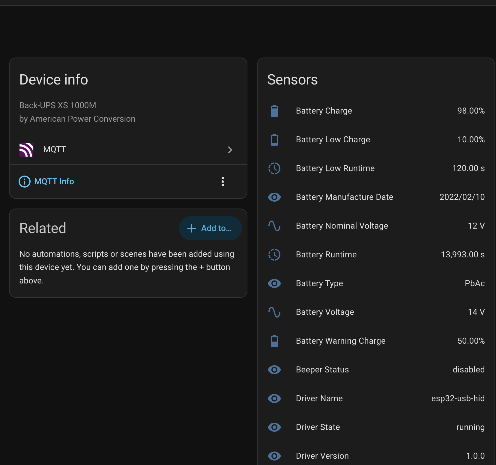
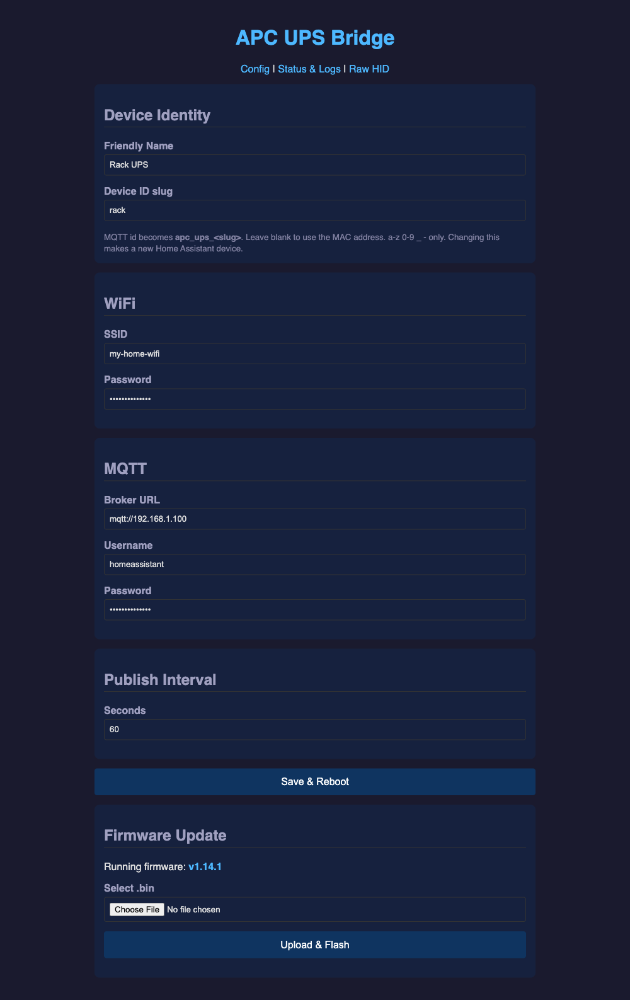
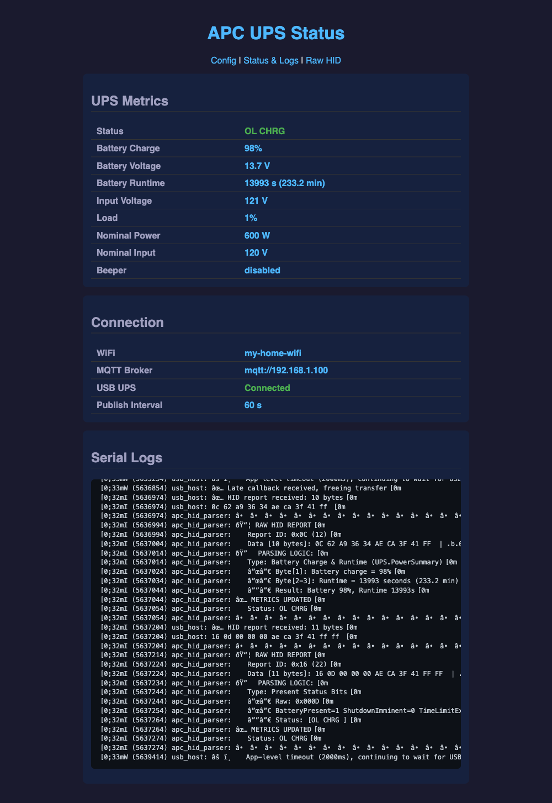

# hms-esp-apc

*A Smart Home Maestro™ project.*

[](https://www.buymeacoffee.com/aamat09)

**An ESP32-S3 that speaks USB HID to your APC UPS directly and publishes 30+ entities to Home Assistant. No NUT, no apcupsd, no host machine.**

Plug the board into the UPS, join its setup WiFi, type your credentials once, and the UPS appears in Home Assistant. Nothing else runs anywhere.

| Home Assistant | Config and OTA | Live status |
|:---:|:---:|:---:|
| [](docs/images/home-assistant.png) | [](docs/images/web-ui.png) | [](docs/images/status-page.png) |
| One device, 30+ entities, discovered automatically | Everything configurable in a browser, firmware included | Live metrics and the HID decode as it happens |

## Why this is different

Most projects treat the UPS as something a *computer* talks to. NUT and apcupsd are daemons on an always-on host. Even ESPHome's UPS support reads the HID report and hands the raw bytes onward for something else to interpret.

This firmware decodes the APC HID report descriptor **on the microcontroller**. `apc_hid_parser.c` walks the report, resolves usage pages to real units, and produces finished values: battery runtime in seconds, load as a percentage, the reason for the last transfer to battery. What leaves the chip is already Home Assistant entities.

The practical result: no server to keep running, no daemon to configure, no parsing layer to maintain. A five dollar chip is the entire stack.

### Monitoring several UPS units together

One board handles one UPS, and Home Assistant will happily show any number of them side by side. If you want a single place to read your whole home's backup power at a glance, [**hms-nut**](https://github.com/hms-homelab/hms-nut) is the companion service for it: a C++ microservice that aggregates every UPS in the house, keeps history in PostgreSQL, and serves its own Angular dashboard.

What that dashboard gives you over per-device entities:

- **A fleet roll-up**, every configured node on one screen, with per-node battery and load meters, 24 hour trend sparklines, and a last-seen indicator.
- **Charts over any stored metric and any range**, plus cross-node comparison that overlays one metric across every monitored unit, so you can see input voltage across the whole house over seven days on a single chart.
- **An AI written daily summary of the entire home.** Once a day the service feeds the previous day's aggregates for every device to an LLM and writes a plain language summary of your energy and power events. Summaries are kept, so the card shows the latest with earlier days behind a toggle. The backend is pluggable: Ollama for fully local, or OpenAI, Gemini, or Anthropic.

It matters here because it reads this firmware's MQTT directly. Set `NUT_ENABLED=false` and it treats ESP32 monitors as first class sources, so you get fleet history, charts, and the daily summary with no NUT daemon anywhere, and no Home Assistant either if you do not want one. It can also poll a real `upsd` alongside, which is useful when some units are on NUT already and some are running this firmware.

The two are independent. Use this firmware alone for a Home Assistant setup, add hms-nut when you outgrow one UPS or want a single dashboard for the whole house.

## Features

- USB HID host communication with APC UPS, with the report parsed on-device
- 30+ Home Assistant entities via MQTT auto-discovery, no YAML required
- **SoftAP captive portal** for setup: no credentials compiled into the firmware
- **Web config UI** for WiFi, MQTT, publish interval, and device naming, persisted to NVS
- **OTA firmware updates** over the network, with an A/B partition layout
- Live status and log page at `/status`
- Editable device identity: friendly name and MQTT device ID slug
- Automatic reconnection for both WiFi and MQTT
- Falls back to simulated data when no UPS is attached, for development

## Quick start

1. Flash the firmware once over USB (see [Build and flash](#build-and-flash)).
2. On first boot the board finds no saved config and raises an open access point named **`APC-XXXX`** (last two bytes of its MAC).
3. Join that network from a phone or laptop. A sign-in page opens automatically. If it does not, browse to **`http://192.168.4.1/`**; every hostname resolves there.
4. Enter your WiFi and MQTT details, then save. The board reboots and joins your network.
5. The UPS appears in Home Assistant under **APC UPS (MAC)**, or whatever friendly name you set.

Settings are stored in NVS, so they survive reflashing. The portal returns automatically if the saved network ever stops accepting the board, which means a router change never requires a USB cable.

## Supported hardware

- **Microcontroller**: ESP32-S3 with USB OTG (M5Stack AtomS3, ESP32-S3-DevKitC, and similar). 4MB flash minimum, required by the A/B OTA layout.
- **UPS**: APC UPS, USB VID `051D`, PID `0002` (Back-UPS) or `0003` (Smart-UPS). Tested with Back-UPS XS 1000M and Smart-UPS C 1500.
- **USB connection**: USB OTG on GPIO19 (D-) and GPIO20 (D+).

### Wiring

| UPS USB | ESP32-S3 |
|---------|----------|
| D- (white) | GPIO19 |
| D+ (green) | GPIO20 |
| VCC (red) | 5V |
| GND (black) | GND |

> **Powering (important)**: the APC UPS USB port is a **5V sink**. It expects VBUS to be supplied to it and outputs no power, so you cannot power the ESP32-S3 from the UPS. Power the board externally (USB-C 5V and GND) and route that same 5V to the UPS `VCC` pin so the UPS USB interface comes up. That is one 5V source feeding both, not two. Tie all grounds together (external GND, board GND, UPS GND); a common ground is required for USB HID to enumerate.

> **Note**: most ESP32-S3 dev boards expose the USB OTG pins on a dedicated connector. If your board uses the USB OTG port for programming over USB-CDC, you may need a hub or OTG adapter.

### What it looks like built

<!-- Drop the two photos into docs/images/ and uncomment this block.
| The board and its two USB-C connections | Installed inside the UPS |
|:---:|:---:|
| [](docs/images/board-wiring.jpg) | [](docs/images/installed.jpg) |
| One USB-C in for 5V, one out to the UPS. That same 5V also feeds the UPS `VCC` pin. | The board runs off a buck converter inside the case, which is why OTA matters. |
-->

The two USB-C connections are the part people get wrong: one is **power in**, the other is the **host link to the UPS**. They are not interchangeable, and the UPS supplies no power on its port.

## Configuration

### Through the web UI (recommended)

Browse to the board's IP address on your network, or `http://192.168.4.1/` while the setup portal is up. Everything is editable there and saved to NVS:

| Setting | Notes |
|---------|-------|
| WiFi SSID and password | Saving a wrong SSID is recoverable: the portal comes back |
| MQTT broker URL | For example `mqtt://192.168.1.100` |
| MQTT username and password | Optional, leave blank if your broker is open |
| Publish interval | 5 to 300 seconds, default 60 |
| Device name | Home Assistant display name, blank gives `APC UPS (MAC)` |
| Device ID slug | MQTT device id `apc_ups_<slug>`, blank gives the MAC |

NVS always wins over anything compiled in.

### Through menuconfig (optional)

`idf.py menuconfig` under **APC UPS Configuration** still exists, for building a pre-provisioned image.

| Setting | Default |
|---------|---------|
| WiFi SSID | *(blank)* |
| WiFi Password | *(blank)* |
| MQTT Broker URL | *(blank)* |
| MQTT Username | *(blank)* |
| MQTT Password | *(blank)* |
| UPS Poll Interval | 5000 ms |
| MQTT Publish Interval | 60000 ms |

The credential defaults ship blank on purpose. A blank SSID is what marks a board unprovisioned and sends it to the setup portal. Keep real values in a local file you do not commit:

```bash
# sdkconfig.local.defaults  (add to .gitignore)
CONFIG_WIFI_SSID="my-network"
CONFIG_WIFI_PASSWORD="my-password"

idf.py -D SDKCONFIG_DEFAULTS="sdkconfig.defaults;sdkconfig.local.defaults" build
```

## Build and flash

Requires [ESP-IDF](https://docs.espressif.com/projects/esp-idf/en/stable/esp32s3/get-started/) v5.3 or later, an MQTT broker, and Home Assistant with the MQTT integration enabled.

```bash
git clone https://github.com/hms-homelab/hms-esp-apc.git
cd hms-esp-apc

idf.py build
idf.py -p PORT flash
```

Then follow [Quick start](#quick-start). No menuconfig step is needed.

> **The serial port disappears after boot.** On the ESP32-S3, GPIO19 and GPIO20 are the same pins backing USB-Serial/JTAG. When the firmware starts the USB host stack it takes that peripheral, and the serial port vanishes from your machine. That is why there is a **10 second boot delay** before USB host initialisation: it is your window to start a reflash. If you miss it, hold **BOOT** and tap **RESET** to enter download mode, where the port stays up indefinitely.

### Updating over the air

Once a board is running, firmware updates need no cable:

1. Open the board's web UI and use the **Firmware Update** card, or
2. `curl -X POST --data-binary @build/apc_usb_mqtt_bridge.bin http://<device-ip>/ota`

The image is written to the inactive OTA slot, verified, and the board reboots into it.

> The **first** OTA-capable image has to be flashed over USB once per board, because it is what lays down the A/B partition table. Earlier single-app builds have nowhere to stage an update.

> **Expect the upload to be slow, and let it finish.** WiFi power save is left at the ESP-IDF default, so the radio sleeps between beacons. Measured on two units: no packet loss, but around 81ms of LAN round trip and download rates between 18 and 76 KB/s depending on placement. A 1MB image can therefore take minutes rather than seconds. The HTTP server allows 300 seconds per socket operation to accommodate this, so a transfer that looks stalled is usually just slow. If it fails part way through, the running firmware is untouched: the image is staged in the inactive slot and only becomes bootable once it verifies.

## Home Assistant entities

Sensors appear automatically under a device named **APC UPS (MAC)**, or your chosen friendly name.

### Battery
| Entity | Unit | Description |
|--------|------|-------------|
| Battery Charge | % | Current battery charge level |
| Battery Voltage | V | Current battery voltage |
| Battery Nominal Voltage | V | Configured battery voltage, for example 12V |
| Battery Runtime | s | Estimated runtime on battery |
| Battery Low Runtime | s | Low runtime threshold |
| Battery Low Charge | % | Low charge threshold |
| Battery Warning Charge | % | Warning charge threshold |
| Battery Type | n/a | Chemistry, for example PbAc |
| Battery Manufacture Date | n/a | Battery manufacture date |

### Input power
| Entity | Unit | Description |
|--------|------|-------------|
| Input Voltage | V | Current input (mains) voltage |
| Input Nominal Voltage | V | Configured nominal voltage, for example 120V |
| Low Voltage Transfer | V | Switch to battery below this voltage |
| High Voltage Transfer | V | Switch to battery above this voltage |
| Input Sensitivity | n/a | Sensitivity setting: low, medium, high |
| Last Transfer Reason | n/a | Why the UPS last switched to battery |

### Output and load
| Entity | Unit | Description |
|--------|------|-------------|
| Load | % | Current load as a percentage of capacity |
| Nominal Power | W | Rated power capacity, for example 600W |

### Status and timers
| Entity | Unit | Description |
|--------|------|-------------|
| UPS Status | n/a | OL (online), OB (on battery), CHRG, LB, and so on |
| Beeper Status | n/a | enabled, disabled, muted |
| Reboot Delay | s | Configured delay before reboot |
| Reboot Timer | s | Active reboot countdown, -1 when inactive |
| Shutdown Timer | s | Active shutdown countdown, -1 when inactive |
| Self-Test Result | n/a | Last self-test outcome |

### Device info
| Entity | Description |
|--------|-------------|
| Driver Name | `esp32-usb-hid` |
| Driver Version | Driver version string |
| Driver State | `running` |
| Power Failure | `OK`, or the failure reason |

## Architecture

FreeRTOS tasks:

1. **USB host task**: manages the USB host stack, receives interrupt transfers (the UPS pushes status changes on its own), and polls feature reports for voltage, load, and thresholds on a configurable interval.
2. **MQTT publish task**: sends Home Assistant discovery configs at startup, then publishes the shared metrics struct on the publish interval.
3. **HTTP server**: serves the config UI, `/status`, `POST /save`, and `POST /ota`. In portal mode it also answers every unmatched URL with a redirect to the config page, which is what makes phones pop the sign-in sheet.
4. **DNS hijack**: only in portal mode. Answers every A query with `192.168.4.1`.
5. **WiFi manager**: STA connection with retry, and the SoftAP fallback that raises the portal.

### Boot logic

```
boot
 |
 +-- NVS holds a WiFi SSID?
       |
       no --> SoftAP portal: open AP "APC-XXXX", DNS catch-all, config page
       |
       yes -> join the network
                |
                +-- joined      --> MQTT + USB host, normal operation
                +-- 10 failures --> SoftAP portal
```

### Data flow

```
APC UPS (USB device)
  |
  | USB HID reports (interrupt + feature)
  v
USB host manager --> APC HID parser --> ups_metrics_t (shared struct)
                                              |
                                              v
                                    MQTT publish task --> broker --> Home Assistant
```

## Known hardware limitations

- **Input frequency**: the Back-UPS XS 1000M reports 0 Hz. This looks like a hardware limitation.
- **Output voltage**: line-interactive models do not measure it separately, so it mirrors input voltage.
- **Firmware version**: not exposed over HID on the tested models.
- **Battery date encoding**: reported as a raw day count, and the decoding varies by model.

## Contributing

Contributions are welcome. Please open an issue or a pull request.

1. Fork the repository
2. Create a feature branch (`git checkout -b feature/my-change`)
3. Commit your changes
4. Push the branch and open a Pull Request

## Disclaimer

This firmware is provided as is, without warranty of any kind, express or implied. You use it at your own risk, and the author accepts no responsibility or liability for any direct, indirect, incidental, or consequential damage, loss, or injury arising from its use or misuse.

Two specific risks are worth stating plainly, because this project involves your mains power equipment:

- **A UPS is not a safe thing to open.** It contains mains voltage, a sealed lead-acid battery capable of very high short-circuit current, and capacitors that stay charged after it is unplugged. Mounting a board inside one is entirely your decision and your risk. Nothing here requires you to open the case; the board works just as well sitting outside it.
- **Wrong wiring can destroy hardware.** Feeding voltage to the wrong pin can damage the ESP32-S3, the UPS USB interface, or both. Verify the connections against your own board's pinout before powering anything up. Doing any of this will likely void your UPS warranty.

Smart Home Maestro™ is a trademark of the author, with a registration application pending. The `hms-` prefix across these repositories stands for it.

This project is not affiliated with, endorsed by, or connected to APC or Schneider Electric. APC, Back-UPS, and Smart-UPS are trademarks of their respective owners, used here only to describe compatibility.

---

## Support

If this project is useful to you, consider buying me a coffee.

[](https://www.buymeacoffee.com/aamat09)

## License

MIT. See [LICENSE](LICENSE).
